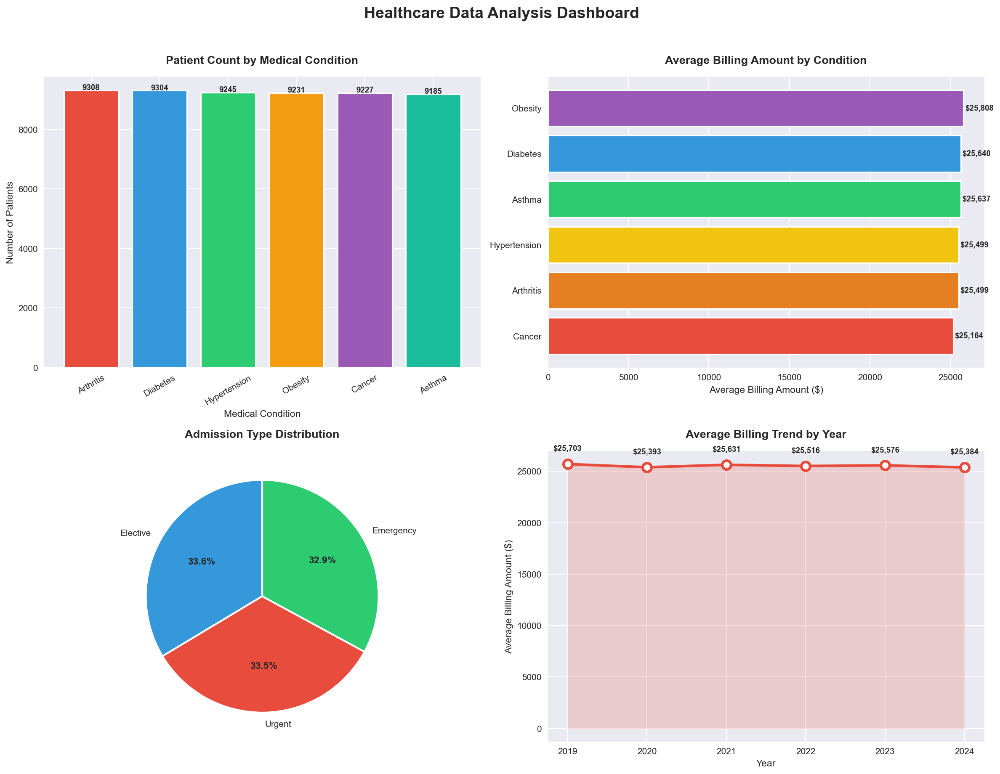
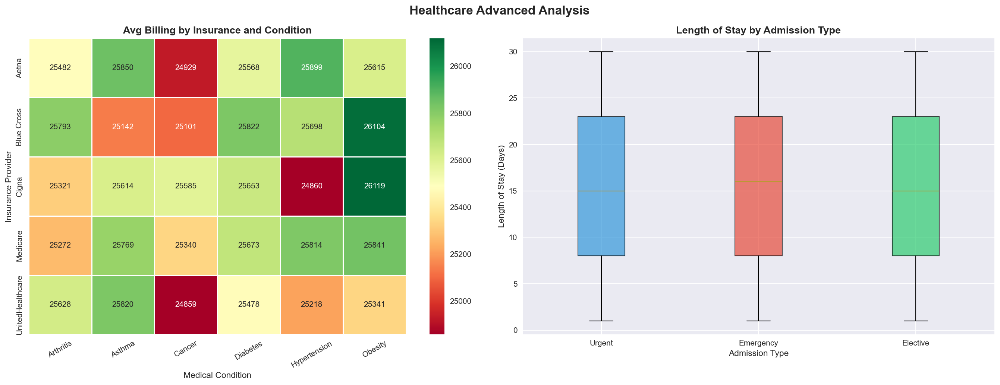
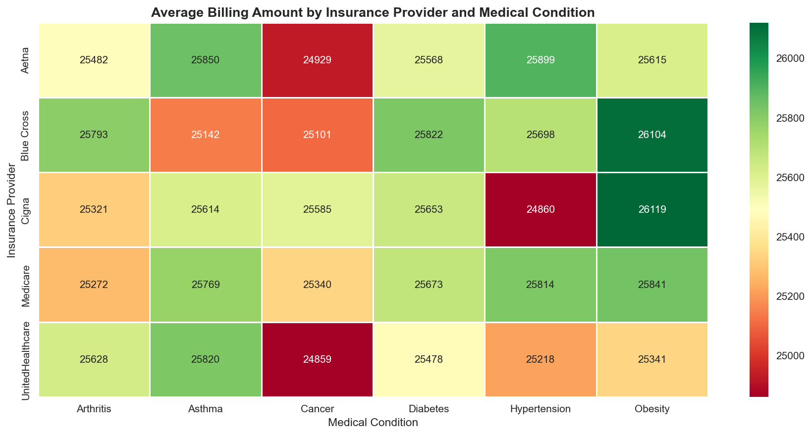

# Healthcare Data Analysis
### Analyst: Jaya Mundre | MS Analytics, Northeastern University | Boston, MA

## Overview
End-to-end healthcare data analysis project on 55,500 patient records
using Python, SQL, and Tableau. This project covers data loading,
cleaning, SQL analysis, and visualizations to uncover insights
from real-world healthcare data.

## Tools and Libraries
- Python — Pandas, NumPy, Matplotlib, Seaborn
- SQL — SQLite3 inside Jupyter Notebook
- Tableau Desktop Public Edition
- Jupyter Notebook

## Dataset
- Source: Kaggle Healthcare Dataset
- Records: 55,500 patients
- Features: Age, Gender, Blood Type, Medical Condition,
  Billing Amount, Insurance Provider, Admission Type,
  Hospital, Doctor, Medication, Test Results, Length of Stay

## Project Steps

### Step 1 - Data Loading and Exploration
- Loaded 55,500 records from CSV file using Pandas
- Explored shape, data types, and unique values
- Identified data quality issues

### Step 2 - Data Cleaning
- Fixed 108 rows with negative billing values
- Standardized patient names to title case
- Converted date columns to DateTime format
- Created new column: Length of Stay (Days)

### Step 3 - SQL Analysis using SQLite3
- Loaded clean data into SQLite database
- Query 1: Medical condition frequency and average billing
- Query 2: Insurance provider patient volume and billing range
- Query 3: Admission type billing and length of stay comparison

### Step 4 - Data Visualizations
- Bar Chart: Patient count by medical condition
- Horizontal Bar: Average billing by condition
- Pie Chart: Admission type distribution
- Line Chart: Average billing trend by year
- Heatmap: Billing by insurance provider and condition
- Box Plot: Length of stay by admission type

## Key Findings
- Total patients analyzed: 55,500
- Average billing amount: $25,541
- Average length of stay: 15.5 days
- Cancer had lower average billing than Obesity across all insurers
- Cigna covered the most patients at 11,249
- All admission types showed similar length of stay distribution
- Obesity had highest average billing at $25,808

## Charts

### Dashboard Overview

### Advanced Analysis

### Heatmap

## Tableau Dashboard
[View Live Healthcare Analytics Dashboard](https://public.tableau.com/app/profile/jaya.mundre/viz/HealthcareAnalyticsDashboard_17809515397400/Dashboard1)

## Connect
- LinkedIn: www.linkedin.com/in/jaya-mundre
- Email: jassimundre99@gmail.com
- GitHub: github.com/jayyu02
